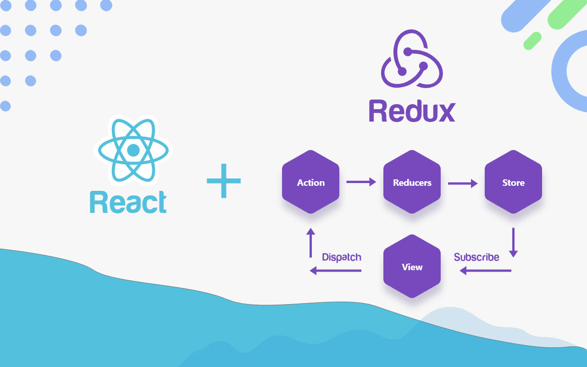
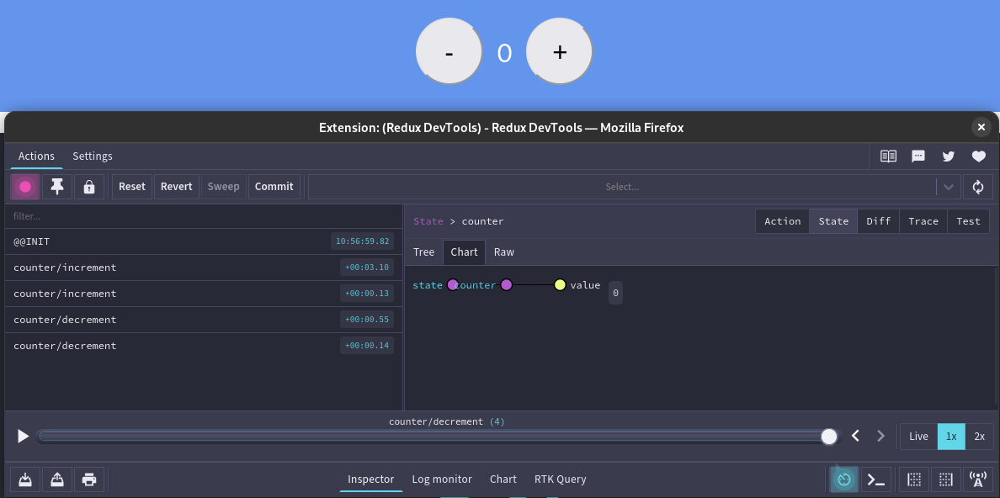
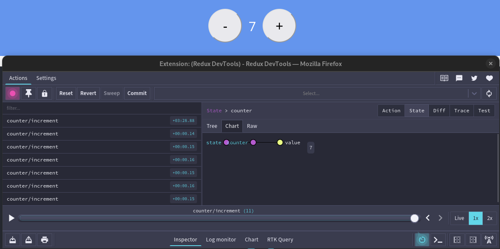

<p align="center">
  
</p>

# Template Redux Toolkit
[Inspiration](https://dmnchzl.medium.com/comment-cr%C3%A9er-un-template-pour-cra-%EF%B8%8F-2ad38421b7b4)


<br/>
<br/>
<br/>
`Redux Toolkit` est une template de `create react app`. Elle est utilisée pour initialiser un projet demandant l'implémentation d'un store Redux.

## Installation

```bash
npx create-react-app my-app --template redux-toolkit
```

## Tips
Pour faciliter le developpement de l'application il est possible d'installer l'extension `Redux DevTools` sur votre navigateur. Cette extension permet de visualiser le store Redux et de voir les actions qui sont dispatchées.



On peut voir que l'action `increment` a été dispatchée et que le state a été mis à jour. Le store stock maintenant la valeur `7` dans la propriété `counter`.
